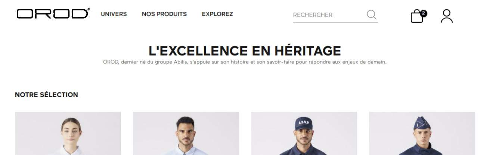
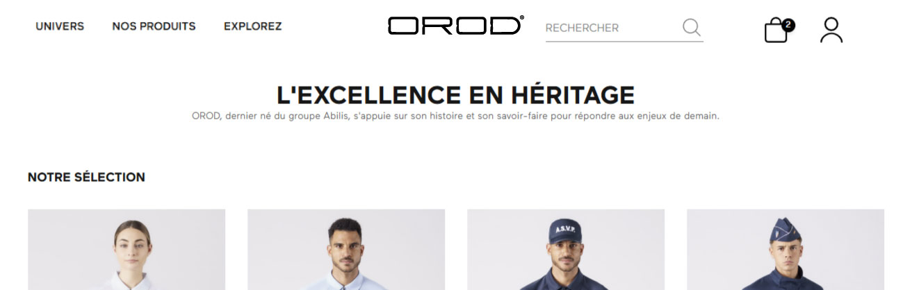

# Expérience Utilisateur (UX) & Identité


💡 **Note SEO 2026 :** Face à l'avalanche de contenus générés par IA, Google utilise désormais l'UX (temps passé, clics, navigation fluide) comme un critère SEO majeur pour différencier les sites d'autorité des sites "spam". Optimiser l'UX d'OROD n'est donc plus seulement une question de conversion, c'est vital pour le référencement.


## Agencement du Header & Menu Principal

**Constat :** L'agencement actuel du header peut être optimisé pour mettre en valeur les éléments qui convertissent le plus. De plus, l'entrée de menu "Explorez" occupe une place de choix sans apporter de forte valeur ajoutée transactionnelle.

<figure><figcaption></figcaption></figure>

**Recommandations :**

* **Barre de recherche & Logo :** Réduire légèrement la taille ou l'espacement des boutons utilitaires (Panier, Compte) afin d'élargir la barre de recherche (élément de conversion central en e-commerce) et de donner plus de respiration au logo.
* **Épuration du Menu Principal :** Conserver les entrées stratégiques "Univers" et "Nos produits". Retirer l'onglet "Explorez" du menu principal.
* **Que faire du contenu "Explorez" ?** Son contenu pourrait être fusionné avec la page "Qui sommes-nous ?" et mis en avant via un bloc dédié plus bas sur la page d'accueil.
* **Regroupement "La Marque" :** Créer un onglet "La Marque" ou "L'Entreprise" qui regrouperait en sous-menu les pages institutionnelles et de réassurance : Qui sommes-nous, Contact, Blog, etc. Cela allège le menu tout en gardant ces pages accessibles.

## Logo du Header

**Constat :** Le logo actuel manque de lisibilité. Son apparence peut être confondue avec un bouton interactif, ce qui brouille l'identité de la marque dès l'arrivée sur le site.

<figure><figcaption></figcaption></figure>

_Figure 1 : Logo actuel aligné à gauche._

<figure><figcaption></figcaption></figure>

_Figure 2 : Test d'affichage avec logo centré pour une meilleure reconnaissance._

**Recommandation :**

* Simplifier le logo ou revoir son contraste.
* Envisager un alignement à gauche ou un centrage plus affirmé avec le nom de la marque en texte clair pour renforcer la reconnaissance immédiate. On pourait passer sur un menu à 2 niveaux dans ce cas.

## Optimisation Mobile (Responsive Design)

**Constat :** Bien que le site soit globalement "responsive", certains éléments de la page d'accueil souffrent de défauts d'intégration sur mobile (smartphones), ce qui nuit à l'aspect professionnel du site.

* **Bouton "Découvrez OROD PM" :** Le bouton d'appel à l'action (CTA) est expulsé en dessous de la vidéo de présentation, créant un grand bloc blanc vide. Il devrait idéalement être superposé à la vidéo ou mieux intégré.
* **Marges du bloc "Chorus Pro" :** Le texte explicatif sur le paiement Chorus Pro touche les bords de l'écran (absence de marges internes/padding), rendant la lecture difficile.



<figure><figcaption></figcaption></figure>



<figure><figcaption></figcaption></figure>



_Figure 3 : Problèmes d'intégration mobile (Bouton CTA détaché et marges manquantes)._

**Recommandation :**

* **Correction CSS Mobile :** Effectuer une repasse d'intégration CSS (Media Queries) spécifiquement pour les résolutions mobiles (moins de 768px).
* Superposer le bouton sur la vidéo (avec un fond légèrement assombri pour la lisibilité) ou réduire la hauteur de la vidéo sur mobile.
* Ajouter un `padding: 15px;` au conteneur du texte Chorus Pro pour l'aérer.

## Partage de liens & Réseaux Sociaux (Open Graph)

**Constat :** Les aperçus de liens (sur WhatsApp, Facebook, LinkedIn) sont inconsistants. L'image ou la description manquent souvent sur l'accueil et les catégories.

<figure><figcaption></figcaption></figure>

_Figure 3 : Comparaison des aperçus de liens sur WhatsApp (produits vs catégories/accueil)._

**Impact :** Un lien sans image est moins cliqué et paraît moins professionnel.\
**Recommandations :**

* **Accueil :** Fixer une image de marque officielle (1200x630px).
* **Catégories :** Mettre en place un système automatique qui génère une image avec le nom de la catégorie sur un fond aux couleurs d'OROD.
* **Produits :** S'assurer que la première photo du produit est systématiquement utilisée.
